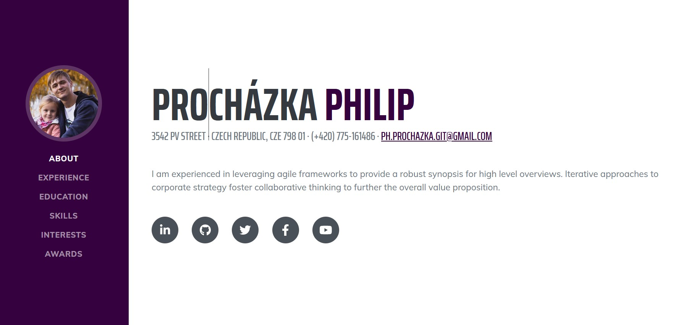

# [Philip Procházka - Resume](https://philipprochazka.github.io)

[Resume](https://philipprochazka.github.io) is a resume and CV theme for [Bootstrap](https://getbootstrap.com/) created by [Start Bootstrap](https://startbootstrap.com/). This theme features a fixed sidebar with content sections to build a simple, yet elegant resume.

## Preview

**[View Live Preview](https://philipprochazka.github.io)**

## Status

## Download and Installation

To begin using this template, choose one of the following options to get started:

-   [Download the latest release on Start Bootstrap](https://startbootstrap.com/theme/resume/)
-   Install using npm: `npm i startbootstrap-resume`
-   Clone the repo: `git clone https://github.com/StartBootstrap/startbootstrap-resume.git`
-   [Fork, Clone, or Download on GitHub](https://github.com/StartBootstrap/startbootstrap-resume)

## Prerequisites

-   NodeJS
    : Technically you do need only NodeJS & the rest depends how you do use this template

-   Git
    : CI & CD environment to get VCS "optional but highly recommended"

-   NPM : Node Package manager

-   Powershell, bash or any other compatible shell :

## Usage

1. Clone the source files of the theme

2. Navigate into the theme's root directory.
3. Run `npm install` and then run `npm start` which will open up a preview of the template in your default browser
4. watch for changes to core template files, and live reload the browser when changes are saved. You can view the `package.json` file to see which scripts are included.
5. Editing your Html output :
   Use .\src\pug\Index.pug
6. Editing your Css output :
   Use .\src\scss\style.scss
7. be kind to yourself and start using nesting

#### npm Scripts

-   `npm run build` builds the project - this builds assets, HTML, JS, and CSS into `dist`
-   `npm run build:assets` copies the files in the `src/assets/` directory into `dist`
-   `npm run build:pug` compiles the Pug located in the `src/pug/` directory into `dist`
-   `npm run build:scripts` brings the `src/js/scripts.js` file into `dist`
-   `npm run build:scss` compiles the SCSS files located in the `src/scss/` directory into `dist`
-   `npm run clean` deletes the `dist` directory to prepare for rebuilding the project
-   `npm run start:debug` runs the project in debug mode
-   `npm start` or `npm run start` runs the project, launches a live preview in your default browser, and watches for changes made to files in `src`

## Bugs and Issues

Have a bug or an issue with this template? [Open a new issue](https://github.com/StartBootstrap/startbootstrap-resume/issues) here on GitHub or leave a comment on the [theme overview page at Start Bootstrap](https://startbootstrap.com/theme/resume/).

## About

Start Bootstrap is an open source library of free Bootstrap themes and templates. All of the free themes and templates on Start Bootstrap are released under the MIT license, which means you can use them for any purpose, even for commercial projects.

-   <https://startbootstrap.com>
-   <https://twitter.com/SBootstrap>

Start Bootstrap was created by and is maintained by **[David Miller](https://davidmiller.io/)**.

-   <https://davidmiller.io>
-   <https://twitter.com/davidmillerhere>
-   <https://github.com/davidtmiller>

Start Bootstrap is based on the [Bootstrap](https://getbootstrap.com/) framework created by [Mark Otto](https://twitter.com/mdo) and [Jacob Thorton](https://twitter.com/fat).

## Copyright and License

Copyright 2013-2023 Start Bootstrap LLC. Code released under the [MIT](https://github.com/StartBootstrap/startbootstrap-resume/blob/master/LICENSE) license.
